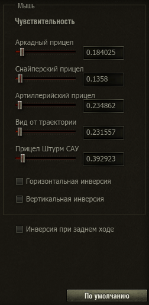

# Better Sense

  

  Точная настройка чувствительности мыши в «Мире танков» — числом и штатным слайдером.

  <a href="../../releases/latest"><strong>Скачать последнюю версию</strong></a>

## Возможности

- Точная настройка всех пяти режимов прицеливания.
- Синхронизация числовых полей и штатных слайдеров.
- Целые и дробные значения через точку или запятую с точностью до шести знаков.

Значение — коэффициент клиента, а допустимый диапазон определяется соответствующим слайдером.

## Установка

Скачайте `.mtmod` из [последнего релиза](../../releases/latest) и поместите его в каталог `mods/<версия клиента>/`.
